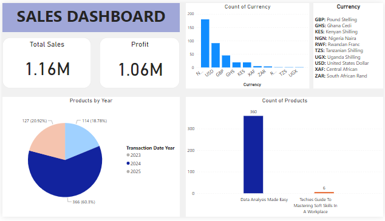

# Twitter-Challenge

---
## Introduction
This project is a Data Analysis challenge given by Mr. Ezekiel on twitter. I decided to join this challenge to improve my skill on data cleaning, analysis, visualization and documentation.

## Data Sourcing
The dataset was provided by Mr. Ezekiel.

## Data cleaning
The dataset was clean but I changed some column format for better visualization. I changed the Transaction date to short date to get rid of the time, also I changed the Product column, it looks better when it’s not in upper case and i did that using the ‘proper function’ in excel. I also search for the country which the currency belongs be more knowledge.

## Visualization/Dashboard
Here is the Dashboard

## Yearly Visualization
I filtered pie chart in the dashboard to see the yearly visualization 
### Year 2023

### Year 2024

### Year 2025

## Conclusion
From the visualization above we could see the following
- The total sale and profit made
- The country that purchased the product most from the currency
- The product sold most
- The year in which the most profit was made

Thanks for reading Through

